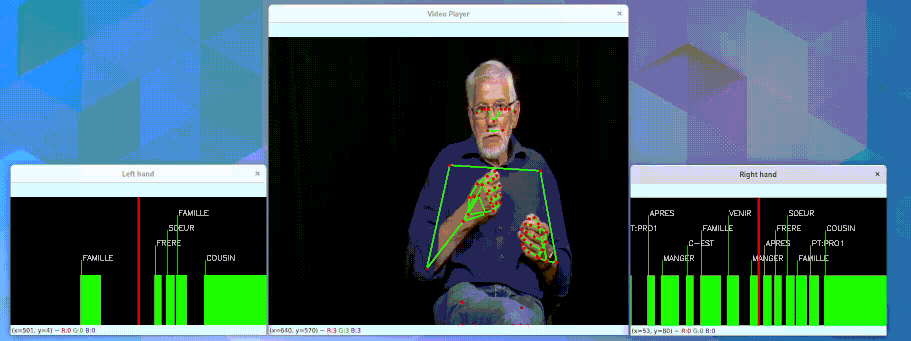

# Video Player

`VideoPlayer` is an OpenCV-based, modular player for visualizing sign language recordings: a video
(or an empty canvas), pose skeletons, annotation timelines, time series or heatmaps, all synchronized
on a single playback clock.

Components are attached to the player as a forest: each root component (e.g. a video, or an empty
canvas) opens its own window, and children (e.g. skeletons overlaid on a video, or a time series
drawn inside an info panel) render into their parent's frame via `parent_name`.



## Example

Overlay pose skeletons on an empty canvas — the typical way to visualize pose-only samples such as
the ones loaded via [`sign-language-data-loading`](data-loading.md):

```python
import numpy as np
from sign_language_tools.player import VideoPlayer
from sign_language_tools.pose.mediapipe.edges import UPPER_POSE_EDGES, HAND_EDGES

pose = np.load("examples/ressources/pose.npy")
left_hand = np.load("examples/ressources/left_hand.npy")
right_hand = np.load("examples/ressources/right_hand.npy")

player = VideoPlayer()
player.attach_empty(width=800, height=600, name="pose data")
player.attach_poses(pose, UPPER_POSE_EDGES, parent_name="pose data")
player.attach_poses(left_hand, HAND_EDGES, edge_color=(255, 0, 0), parent_name="pose data")
player.attach_poses(right_hand, HAND_EDGES, edge_color=(0, 0, 255), parent_name="pose data")

player.play(speed=0.5)
```

Or play a video file directly, overlaying its annotation segments:

```python
from sign_language_tools.player import VideoPlayer

player = VideoPlayer()
player.attach_video_file("video.mp4", name="video")
player.attach_segments(
    segments,          # (M, 2) or (M, 3) array of [start, end(, label)]
    unit="s",
    labels=["bonjour", "merci"],
    parent_name="video",
)
player.play()
```

## Controls

Once `play()` is running, the following keys control playback:

| Key       | Action                          |
|-----------|----------------------------------|
| `Space`   | Pause / resume                   |
| `→`       | Seek forward (10s by default)    |
| `←`       | Seek backward (10s by default)   |
| `q`       | Quit                              |

## Reference

::: sign_language_tools.player.player.VideoPlayer
::: sign_language_tools.player.player.PlaybackClock
