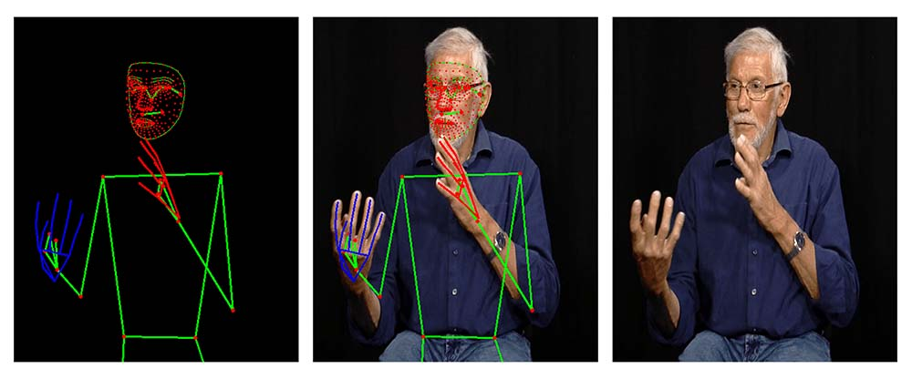

# Pose

The `pose` submodule covers the full lifecycle of pose landmarks: extracting them from video with
MediaPipe, describing their skeleton connectivity, transforming/augmenting them, and plotting them.

Across the submodule, a pose sequence is represented as a `numpy` array of shape `(T, L, C)`, where
`T` is the number of frames, `L` the number of landmarks, and `C` the number of coordinates per
landmark (usually 3: x, y, z).

## Extracting landmarks with MediaPipe

`sign_language_tools.pose.mediapipe.extraction` wraps MediaPipe's holistic landmarker to extract
pose, hands and face landmarks from a video file frame by frame.

```python
from sign_language_tools.pose.mediapipe.extraction import (
    load_holistic_landmarker,
    extract_poses_from_video_file,
)

landmarker = load_holistic_landmarker("holistic_landmarker.task")
poses = extract_poses_from_video_file("video.mp4", landmarker, show_progress=True)

poses["pose"].shape        # (T, 33, 3)
poses["left_hand"].shape   # (T, 21, 3)
poses["right_hand"].shape  # (T, 21, 3)
poses["face"].shape        # (T, 478, 3)
```



Frames where a body part wasn't detected are filled with `NaN`; see
[`InterpolateMissing`][sign_language_tools.pose.transforms.interpolate.InterpolateMissing] to fill
them in.

## Skeleton connectivity

`sign_language_tools.pose.mediapipe.edges` and `sign_language_tools.pose.mediapipe.vertices` provide
the connectivity (edges) and landmark groupings (vertices) for the MediaPipe skeletons, and
`sign_language_tools.pose.openpose.edges` provides the equivalent for OpenPose. These are typically
used to draw skeletons (see [Visualization](#visualization) and the [Video Player](player.md)) or to
build graph structures over the landmarks.

```python
from sign_language_tools.pose.mediapipe.edges import POSE_EDGES, HAND_EDGES, FACE_EDGES
from sign_language_tools.pose.mediapipe.vertices import LIPS_VERTICES
```

## Transforms

`sign_language_tools.pose.transforms` provides data-augmentation and preprocessing transforms for
pose sequences, compatible with PyTorch/TensorFlow data pipelines. They can be composed with
[`Compose`][sign_language_tools.common.transforms.compose.Compose] from the [common](common.md)
submodule.

```python
import numpy as np
from sign_language_tools.pose.transforms import (
    Concatenate, TemporalRandomCrop, HorizontalFlip, Split, InterpolateMissing,
)

landmarks = {
    "pose": np.load("examples/ressources/pose.npy"),
    "left_hand": np.load("examples/ressources/left_hand.npy"),
    "right_hand": np.load("examples/ressources/right_hand.npy"),
}

pipeline = [
    InterpolateMissing(),
    Concatenate(["pose", "right_hand", "left_hand"]),
    TemporalRandomCrop(size=60),
    HorizontalFlip(),
    Split({"pose": 33, "right_hand": 21, "left_hand": 21}),
]

x = landmarks
for transform in pipeline:
    x = transform(x)
```

Transforms operating on a single array (e.g. `TemporalRandomCrop`, `HorizontalFlip`,
`InterpolateMissing`) take and return a `(T, L, C)` array. `Concatenate` and `Split` bridge between
a `dict[str, np.ndarray]` of landmark groups (e.g. `{"pose": ..., "left_hand": ...}`) and a single
concatenated `(T, L, C)` array, so that group-agnostic transforms can be applied uniformly.

## Visualization

`sign_language_tools.pose.visualization` provides two plotting backends for landmarks: static
`matplotlib` figures, one frame or a whole sequence at a time, and interactive `plotly` figures. For
interactive playback synced to a video, see the [Video Player](player.md) instead.

### Static plots

```python
from sign_language_tools.pose.visualization import plot_landmarks, plot_landmarks_sequence
from sign_language_tools.pose.mediapipe.edges import POSE_EDGES, HAND_EDGES

# A single frame
plot_landmarks(landmarks["pose"][0], connections=POSE_EDGES)

# A short sequence, one subplot per frame
fig = plot_landmarks_sequence(
    {"pose": landmarks["pose"][:5], "right_hand": landmarks["right_hand"][:5]},
    {"pose": POSE_EDGES, "right_hand": HAND_EDGES},
)
```

### Interactive plots

[`plot_pose_2d`][sign_language_tools.pose.visualization.plotly.graph_2d.plot_pose_2d] draws a single
pose as an interactive `plotly` figure: pan and zoom, hover a landmark to read its group, index and
coordinates, and click a legend entry to hide or show a whole group. It takes the landmark groups and
their edges as two dicts sharing the same keys, so the output of
`extract_poses_from_video_file` can be passed almost directly.

```python
from sign_language_tools.pose.visualization import plot_pose_2d
from sign_language_tools.pose.mediapipe.edges import UPPER_POSE_EDGES, HAND_EDGES

edges = {"pose": UPPER_POSE_EDGES, "left_hand": HAND_EDGES, "right_hand": HAND_EDGES}

# Frame 42 of a `(T, L, C)` sequence, zoomed on the landmarks
plot_pose_2d(landmarks, edges, frame=42, refocus=True)

# Checking a hand edge definition, index by index
plot_pose_2d(
    {"right_hand": landmarks["right_hand"]},
    {"right_hand": HAND_EDGES},
    frame=42,
    show_indices=True,
    refocus=True,
)
```

Each group gets its own color, taken from
[`DEFAULT_GROUP_COLORS`][sign_language_tools.pose.visualization.plotly.common.DEFAULT_GROUP_COLORS]
for the usual group names and from
[`CATEGORICAL_PALETTE`][sign_language_tools.pose.visualization.plotly.common.CATEGORICAL_PALETTE]
otherwise. Pass `colors={"face": "#c3c2b7"}` to override individual groups, and `vertex_size` or
`edge_width` (a shared value, or a dict per group) to make dense groups such as the face recede:

```python
plot_pose_2d(landmarks, edges, frame=42, vertex_size={"face": 2, "pose": 6}, colors={"face": "#c3c2b7"})
```

### Playing a sequence

[`plot_pose_sequence_2d`][sign_language_tools.pose.visualization.plotly.graph_2d.plot_pose_sequence_2d]
takes the same arguments but expects `(T, L, C)` sequences, and adds a play button and a timeline.
The axis limits are computed once over the whole selection, so the pose moves against a fixed frame
rather than the axes rescaling under it.

```python
from sign_language_tools.pose.visualization import plot_pose_sequence_2d

plot_pose_sequence_2d(landmarks, edges, fps=25, renderer="browser")
```

!!! warning "Every frame is embedded in the figure"

    A plotly animation carries a full copy of the data for each frame: measured at ~8 KB per frame
    for a body and two hands, and ~30 KB once the 478-landmark face is included. A 3000-frame clip
    would therefore weigh 24 MB, or 92 MB with the face.

    `max_frames` (500 by default) caps this by keeping every n-th frame, and warns you with the
    stride it used. The frames keep their **true indices** as labels, so the timeline still tells you
    where you are in the original sequence.

To study a passage closely, select it with `frames` — anything shorter than `max_frames` is shown at
full temporal resolution, with no warning:

```python
# every 6th frame of a 3000-frame clip, ~4.7 MB
plot_pose_sequence_2d(landmarks, edges)

# frames 120-180, every single one
plot_pose_sequence_2d(landmarks, edges, frames=slice(120, 180))

# or an explicit list
plot_pose_sequence_2d(landmarks, edges, frames=[10, 20, 30])
```

Dropping the face is the single biggest saving, since it is 478 of the 553 landmarks.

#### Playback speed

The figure carries a `Pause` button and one button per playback speed. Plotly fixes the frame
duration when an animation starts and cannot change it mid-flight, so speed cannot be a slider:
each button restarts playback **from the current frame** at its own rate.

`fps` sets what `1×` means, counted in frames of the **original** sequence — so set it to the frame
rate of your source video and `1×` plays at real speed, whatever stride `max_frames` chose. A
3000-frame clip at 25 fps takes 120 s at `1×` whether it is shown in full or every 6th frame.

```python
# default speeds: 0.1x, 0.25x, 0.5x, 1x, 2x
plot_pose_sequence_2d(landmarks, edges, fps=50)          # source video is 50 fps

# frame-by-frame study of a fast transition
plot_pose_sequence_2d(landmarks, edges, speeds=(0.05, 0.1, 1.0))
```

For genuinely frame-by-frame inspection, the timeline is often better than slow playback: drag the
handle, or click it and use the arrow keys.

### 3D plots, and reference frames

[`plot_pose_3d`][sign_language_tools.pose.visualization.plotly.graph_3d.plot_pose_3d] takes the same
arguments and draws the pose in a scene you can orbit, using the third coordinate as depth. The scene
is oriented so that the pose stands upright and is seen from the front.

!!! warning "The depth of each body part is measured from a different origin"

    `x` and `y` are normalized to the image and therefore already share a frame, but `z` is not.
    MediaPipe measures the depth of the pose **from the midpoint of the hips**, the depth of each
    hand **from that hand's own wrist**, and the depth of the face from the head. Plotted as-is, the
    hands collapse onto a slab at hip depth instead of sitting in front of the chest.

    This never shows up in 2D, which is why `plot_pose_2d` needs no such care.

Pass `align` to bring the groups into one frame. A
[`SharedLandmark`][sign_language_tools.pose.reference_frames.SharedLandmark] states that a landmark of
one group is physically the same point as a landmark of another, which is enough to translate it:

```python
from sign_language_tools.pose.visualization import plot_pose_3d
from sign_language_tools.pose.mediapipe.reference_frames import MEDIAPIPE_DEPTH_ALIGNMENT

plot_pose_3d(landmarks, edges, frame=42, align=MEDIAPIPE_DEPTH_ALIGNMENT)
```

[`MEDIAPIPE_DEPTH_ALIGNMENT`][sign_language_tools.pose.mediapipe.reference_frames.MEDIAPIPE_DEPTH_ALIGNMENT]
moves each hand onto the corresponding pose wrist and the face onto the pose nose, **correcting the
depth only** so the `x` and `y` you already trust are left untouched. For the metric
`*_world_landmarks`, where no axis is shared, use
[`MEDIAPIPE_WORLD_ALIGNMENT`][sign_language_tools.pose.mediapipe.reference_frames.MEDIAPIPE_WORLD_ALIGNMENT]
instead, which translates on all three axes.

Nothing is aligned by default: only you know which frame your landmarks are in, and they may well not
come from MediaPipe. For another estimator, write the mapping yourself — it is only a group name and
two landmark indices:

```python
from sign_language_tools.pose.reference_frames import SharedLandmark

# "landmark 0 of the left hand is the same point as landmark 7 of the body"
align = {"left_hand": SharedLandmark(group="body", landmark=7, own_landmark=0, axes=(2,))}
```

[`align_reference_frames`][sign_language_tools.pose.reference_frames.align_reference_frames] is also
usable on its own, outside of plotting, if you need the aligned arrays themselves.

### Playing a sequence in 3D

[`plot_pose_sequence_3d`][sign_language_tools.pose.visualization.plotly.graph_3d.plot_pose_sequence_3d]
combines the two: the timeline and speed buttons of the 2D player, in an orbitable scene.

```python
from sign_language_tools.pose.visualization import plot_pose_sequence_3d

plot_pose_sequence_3d(landmarks, edges, align=MEDIAPIPE_DEPTH_ALIGNMENT, fps=25, renderer="browser")
```

Two things are handled so the scene stays usable while it plays:

- **The scene keeps its bounds.** The axis ranges are computed once over the whole selection, so the
  pose moves inside a fixed box rather than the scene rescaling around it every frame. (The
  single-pose `plot_pose_3d` still autoranges, since it has nothing to stay consistent with.)
- **The camera survives playback.** A stable `uirevision` keeps your orbit and zoom as the frames
  advance, so you can choose a viewpoint and then watch the sign from it. Without it, plotly snaps
  back to the default front view the moment playback starts. Double-click the scene to reset.

## Reference

### Extraction

::: sign_language_tools.pose.mediapipe.extraction.load_holistic_landmarker
::: sign_language_tools.pose.mediapipe.extraction.extract_poses_from_video_file

### Reference frames

::: sign_language_tools.pose.reference_frames.SharedLandmark
::: sign_language_tools.pose.reference_frames.align_reference_frames
::: sign_language_tools.pose.mediapipe.reference_frames.MEDIAPIPE_DEPTH_ALIGNMENT
::: sign_language_tools.pose.mediapipe.reference_frames.MEDIAPIPE_WORLD_ALIGNMENT

### Edges and vertices

::: sign_language_tools.pose.mediapipe.edges
    options:
        show_source: false
        members: false
::: sign_language_tools.pose.mediapipe.vertices
    options:
        show_source: false
        members: false
::: sign_language_tools.pose.openpose.edges
    options:
        show_source: false
        members: false

### Transforms

::: sign_language_tools.pose.transforms.center.CenterOnLandmarks
::: sign_language_tools.pose.transforms.clip.Clip
::: sign_language_tools.pose.transforms.concatenate.Concatenate
::: sign_language_tools.pose.transforms.drop_coordinates.DropCoordinates
::: sign_language_tools.pose.transforms.drop_frames.DropRandomFrames
::: sign_language_tools.pose.transforms.edge_normalize.NormalizeByReferenceEdge
::: sign_language_tools.pose.transforms.filter.FilterEmpty
::: sign_language_tools.pose.transforms.filter.FilterLandmarks
::: sign_language_tools.pose.transforms.flatten.Flatten
::: sign_language_tools.pose.transforms.flatten.Unflatten
::: sign_language_tools.pose.transforms.flip.HorizontalFlip
::: sign_language_tools.pose.transforms.interpolate.InterpolateMissing
::: sign_language_tools.pose.transforms.noise.GaussianNoise
::: sign_language_tools.pose.transforms.normalize.MinMaxNormalization
::: sign_language_tools.pose.transforms.normalize.Standardization
::: sign_language_tools.pose.transforms.normalize.FixedResolutionNormalization
::: sign_language_tools.pose.transforms.optical_flow.ToOpticalFlow
::: sign_language_tools.pose.transforms.padding.Padding
::: sign_language_tools.pose.transforms.resample.Resample
::: sign_language_tools.pose.transforms.resample.RandomResample
::: sign_language_tools.pose.transforms.rotate_2d.Rotation2D
::: sign_language_tools.pose.transforms.rotate_2d.RandomRotation2D
::: sign_language_tools.pose.transforms.rotate_2d.MakeReferenceEdgeHorizontal
::: sign_language_tools.pose.transforms.scale.Scale
::: sign_language_tools.pose.transforms.scale.RandomScale
::: sign_language_tools.pose.transforms.smoothing.SavitzkyGolayFiltering
::: sign_language_tools.pose.transforms.split.Split
::: sign_language_tools.pose.transforms.temporal_crop.TemporalCrop
::: sign_language_tools.pose.transforms.temporal_crop.TemporalRandomCrop
::: sign_language_tools.pose.transforms.temporal_scale.TemporalScale
::: sign_language_tools.pose.transforms.temporal_scale.RandomTemporalScale
::: sign_language_tools.pose.transforms.to_img.ToRGBImage
::: sign_language_tools.pose.transforms.translation.Translation
::: sign_language_tools.pose.transforms.translation.RandomTranslation

### Visualization

::: sign_language_tools.pose.visualization.landmarks.plot_landmarks
::: sign_language_tools.pose.visualization.landmarks.plot_landmarks_sequence
::: sign_language_tools.pose.visualization.plotly.graph_2d.plot_pose_2d
::: sign_language_tools.pose.visualization.plotly.graph_2d.plot_pose_sequence_2d
::: sign_language_tools.pose.visualization.plotly.graph_3d.plot_pose_3d
::: sign_language_tools.pose.visualization.plotly.graph_3d.plot_pose_sequence_3d
::: sign_language_tools.pose.visualization.plotly.common.CATEGORICAL_PALETTE
::: sign_language_tools.pose.visualization.plotly.common.DEFAULT_GROUP_COLORS
