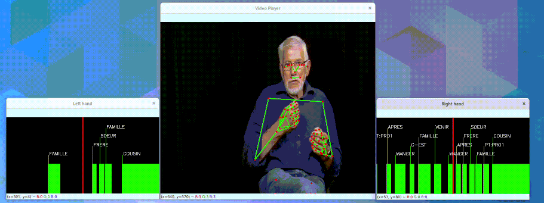

This modules provides an interface to visualise and save video clips or frames of sign language datasets. The video could be enriched by annotations and overlays such as pose information. The annotations linked to the video could also be displayed liked showed in this example : 

Hands on example of how to use the video player could be found in the [`examples` folder](https://github.com/ppoitier/sign-language-tools/tree/main/examples) in the project repository. Once the player is launched, you can:

- Use **S** key to save the current frame in the screenshot folder
- Use **Space** to play and pause the current video
- Use the **Arrows** to move back and forth in the video
- Use **Q** to exit the video player

The `VideoPlayer` allows you to configure the result you want to see by attaching information. The object that could be attached are the following :

- **Video**: Only one video could be attached to the player. The video could either be a video file or a folder containing one image for each frame of the video.
- **Pose**: You can attach as many pose as you like to a player. If you are using Mediapipe of OpenPose, the [`pose`](pose.md) module provides some useful functions to pre-process or modify those landmarks.
- **Segments**: A segment is represented by a `start` timestamp, an `end` timestamp and a label. Segments represents annotations associated with the video and will be displayed along with it.

For more information about the `VideoPlayer` object and its methods refer to the [reference](reference.md)